# 🌱 RE-School Ecology

## Project Description
**RE-School Ecology** is a web application developed during an internship at **Reschool Education** (February – June 2022), aimed at **intelligently managing waste in schools**.

The platform enables:
- **Real-time monitoring** of connected trash bin fill levels.  
- **Optimized collection routes** for sanitation workers.  
- **Raising students’ awareness** about ecological issues through an interactive interface.  

---

## Tech Stack
- **Frontend:** React.js, HTML5, CSS3, JavaScript (ES6)  
- **Backend:** Laravel (PHP), MySQL  
- **Tools & Methodology:** GitHub, JIRA, Scrum, Agile Methods  

---

## Main Features
- Interactive dashboard
- Management of workers and trucks
- Management of bins and work zones
- Statistics and tracking of collected and sold waste
- Secure login system with validation
- Responsive interface and dark mode
- Integration of messages and alerts for success or error notifications

---
## Key Skills
- React.js  
- Laravel / PHP  
- MySQL  
- Git & GitHub  
- Web Application Development  
- JIRA / Scrum  
- Agile Methodologies

---
## Project Screenshots

### Interface and Navigation

  

    
Home Page – Dashboard Overview

    
  

  <table>
    <tr>
        <td align="center">
            
Login Page – User Authentication Form

            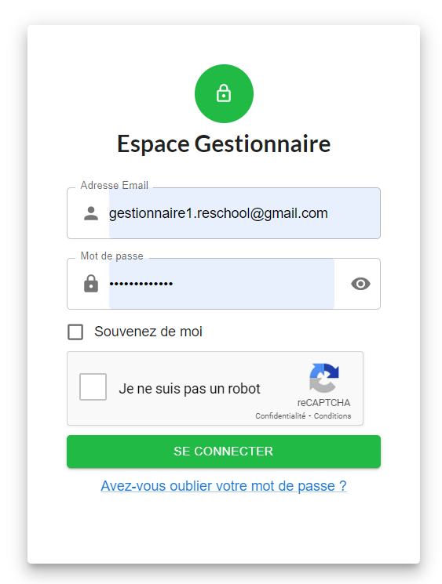
        </td>
        <td align="center">
            
Error Message Displayed After Wrong Password Attempt

            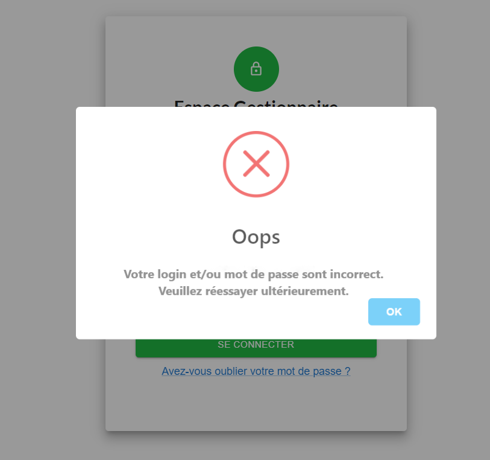
        </td>
    </tr>
</table>

---

### Profile and User Management
<table>
    <tr>
        <td align="center">
            
User Profile Page Display

            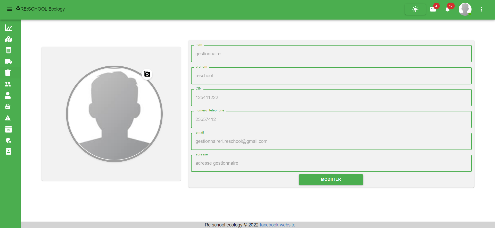
        </td>
        <td align="center">
            
Dark Mode Profile Page

            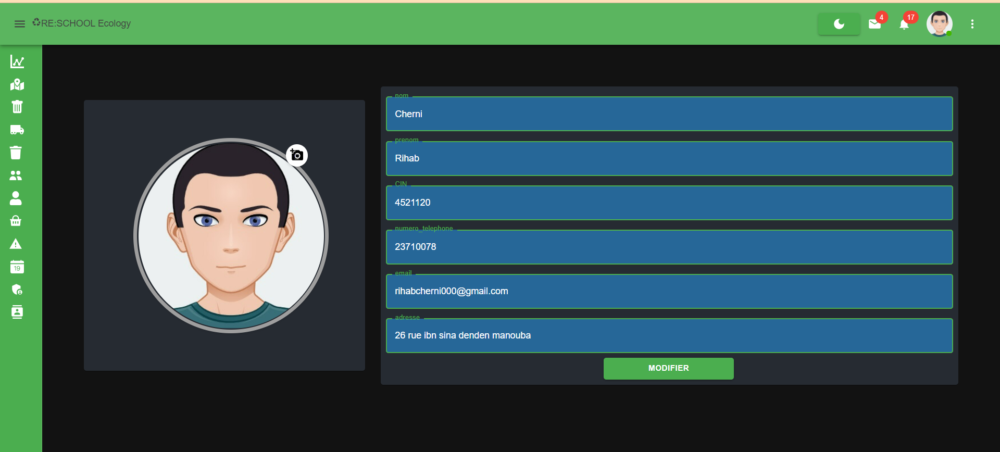
        </td>
    </tr>
    <tr>
        <td align="center">
            
User Logout Action

            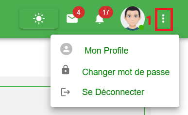
        </td>
        <td align="center">
            
Administrator Profile Menu View

            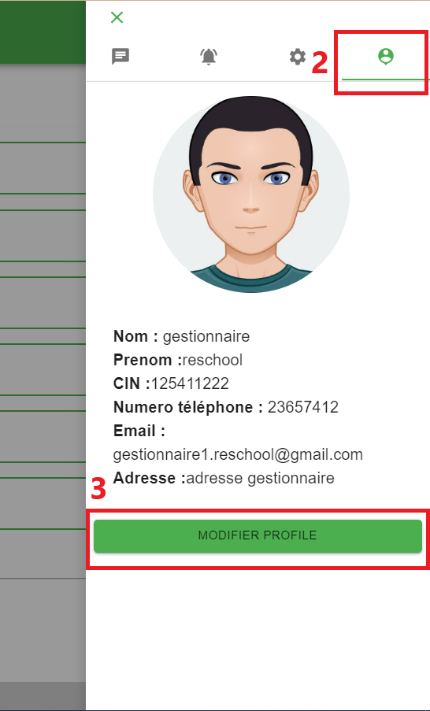
        </td>
    </tr>
</table>

---

### Worker Management
<table>
    <tr>
        <td align="center">
            
Worker Details View

            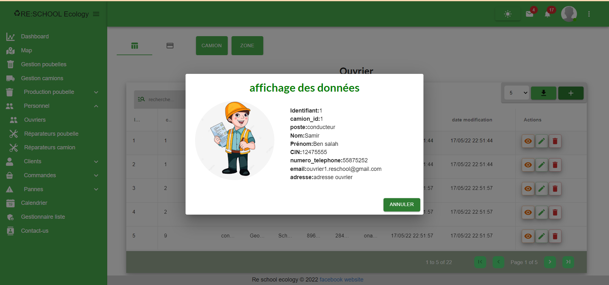
        </td>
        <td align="center">
            
Add New Worker Form

            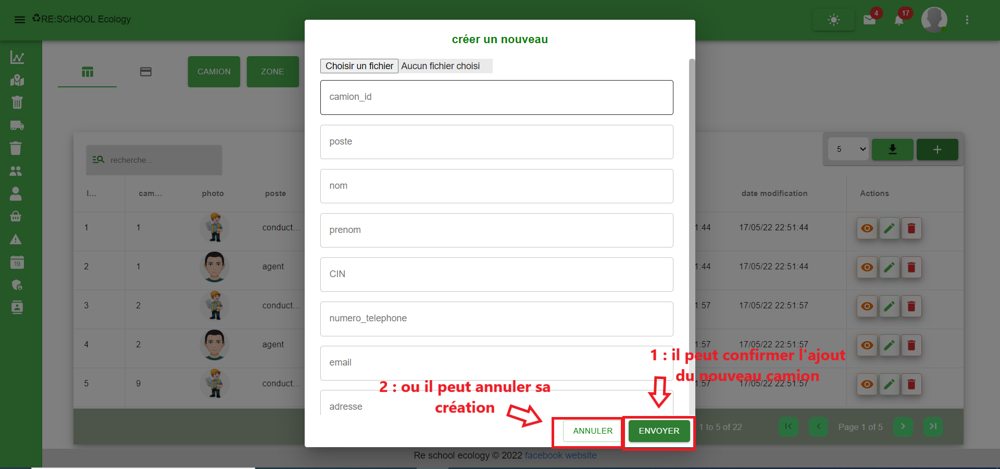
        </td>
    </tr>
    <tr>
        <td align="center" colspan="2">
            
Workers Table Overview

            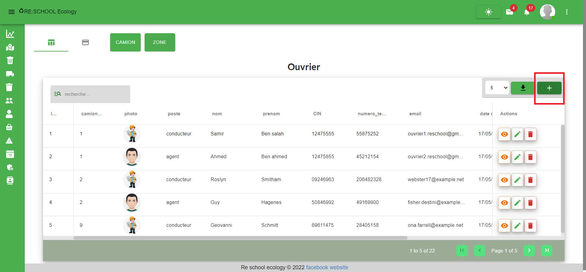
        </td>
    </tr>
</table>

---

### Truck Management
<table>
    <tr>
        <td align="center">
            
Truck Deletion Confirmation Prompt

            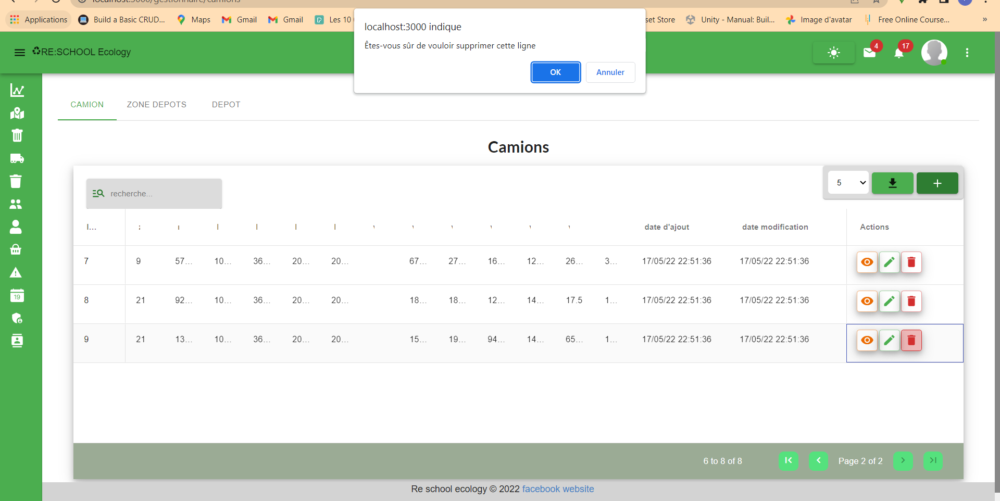
        </td>
        <td align="center">
            
Truck Deletion – Success Message Display

            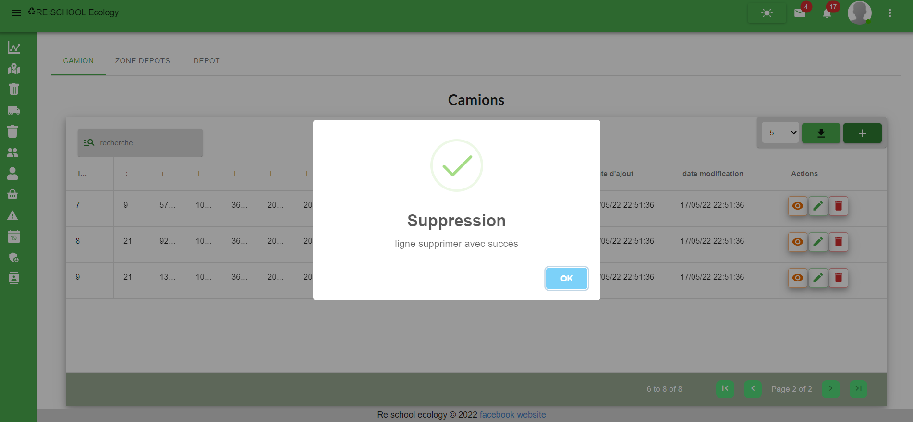
        </td>
    </tr>
</table>

---

### Bin and Work Zone Management
<table>
    <tr>
        <td align="center">
            
Bins Table Overview

            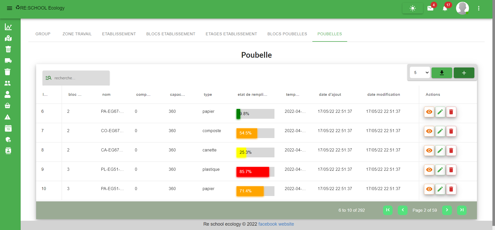
        </td>
        <td align="center">
            
Work Zones Table Overview

            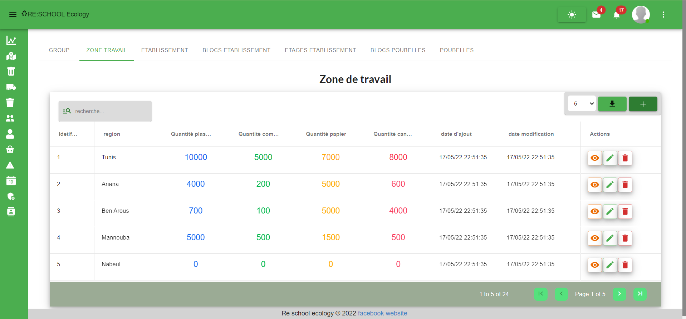
        </td>
    </tr>
    <tr>
        <td align="center">
            
Bin Groups Table Overview

            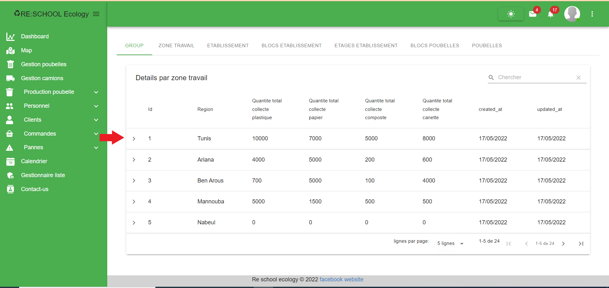
        </td>
        <td align="center">
            
Work Zone Details Table Overview

            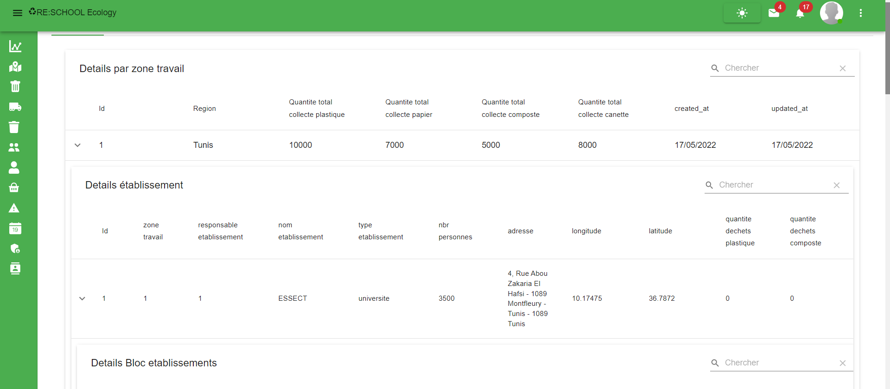
        </td>
    </tr>
</table>

---

### Malfunction Management
<table>
    <tr>
        <td align="center">
            
Truck Malfunction Management

            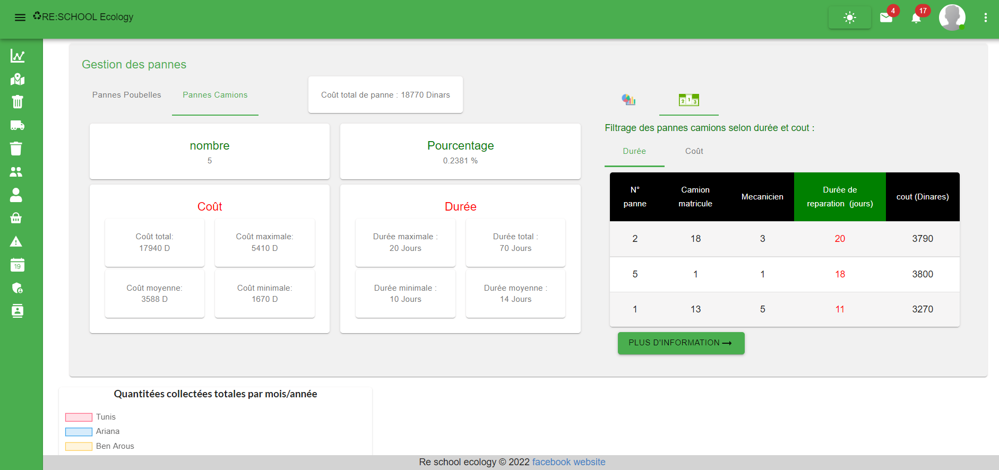
        </td>
        <td align="center">
            
Bin Malfunction Management

            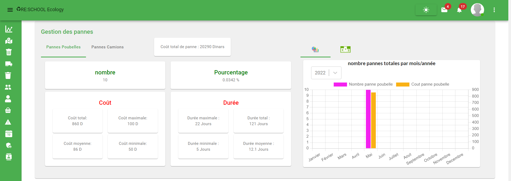
        </td>
    </tr>
</table>

---

### Dashboard and Statistics
<table>
    <tr>
        <td align="center" colspan="2">
            
Dashboard – Counters Interface

            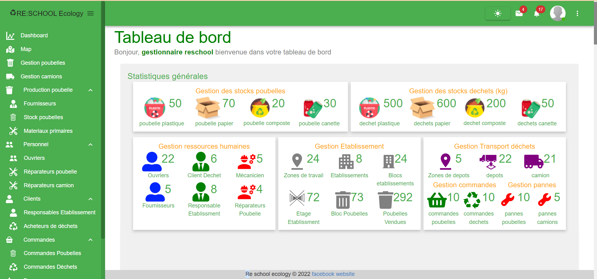
        </td>
    </tr>
    <tr>
        <td align="center">
            
Total Collected Waste by Month and Year

            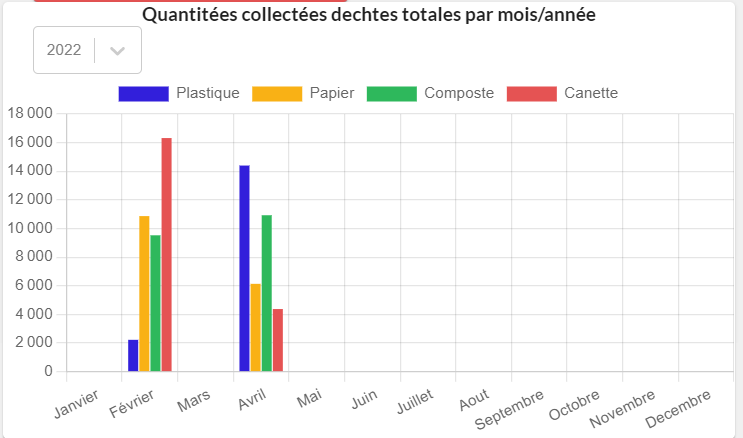
        </td>
        <td align="center">
            
Total Sold Waste by Month

            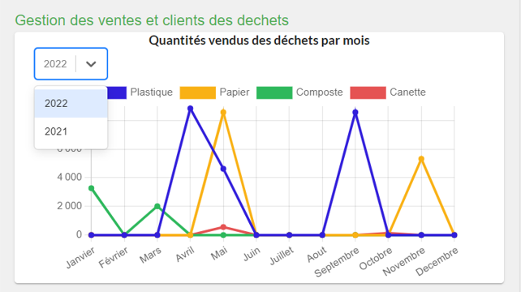
        </td>
    </tr>
</table>

---

### Map and Geolocation
<table>
    <tr>
        <td align="center">
            
Map View Before Click Action

            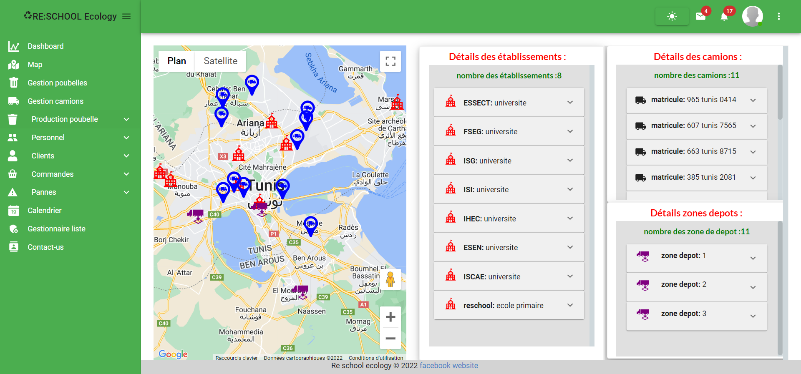
        </td>
        <td align="center">
            
Map View After Click Action

            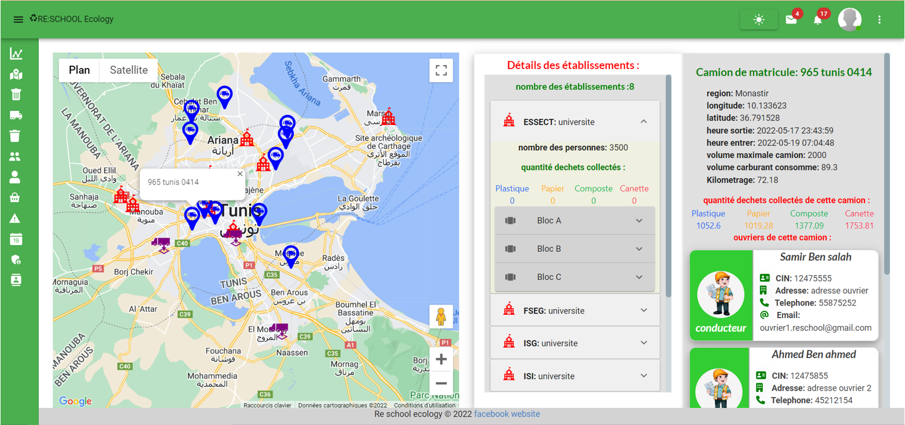
        </td>
    </tr>
    <tr>
        <td align="center" colspan="2">
            
Map – Displaying School Details by Zone

            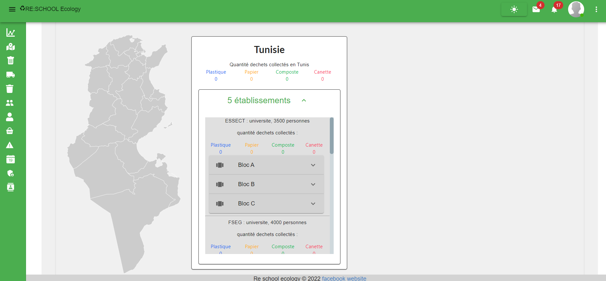
        </td>
    </tr>
</table>
---
