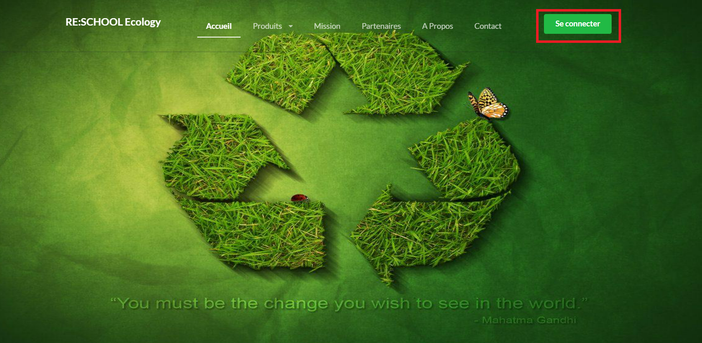
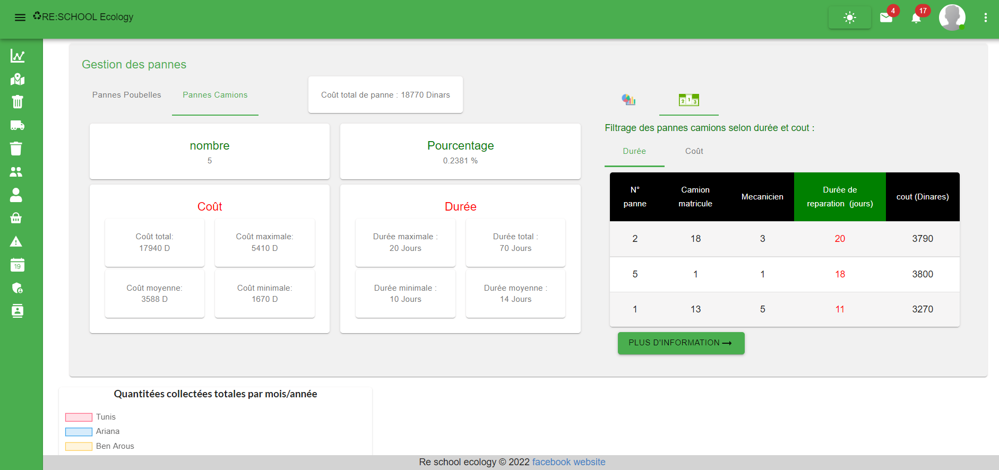
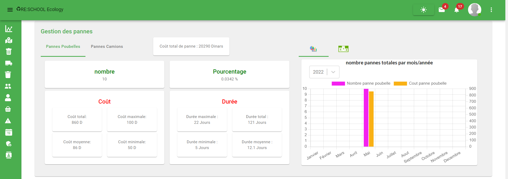

# 🌱 RE-School Ecology

## Description du projet
**RE-School Ecology** est une application web développée dans le cadre d’un stage chez **Reschool Education** (Février – Juin 2022), visant à **gérer intelligemment les déchets dans les établissements scolaires**.

La plateforme permet :
- Le **suivi en temps réel** du niveau de remplissage des poubelles connectées.  
- L’**optimisation des itinéraires de collecte** pour les agents de propreté.  
- La **sensibilisation des élèves aux enjeux écologiques** à travers une interface interactive.  

---

## Stack technique
- **Frontend:** React.js, HTML5, CSS3, JavaScript (ES6)  
- **Backend:** Laravel (PHP), MySQL  
- **Outils & Méthodologie:** GitHub, JIRA, Scrum, Méthodes agiles  

---

## Fonctionnalités principales
- Tableau de bord interactif
- Gestion des ouvriers et camions
- Gestion des poubelles et des zones de travail
- Statistiques et suivi des déchets collectés et vendus
- Système de login sécurisé avec validation
- Interface responsive et mode sombre
- Intégration des messages et alertes pour actions réussies ou erreurs

---

## Screenshots du projet

### Interface et navigation
- Accueil  

- Login + logo  

- Login  

- Champ obligatoire login  

- Mauvais mot de passe  

- Test login  

- Test login faux email  

---

### Profil et gestion des utilisateurs
- Affichage page profile  

- Dark profile  

- Modifier profile  

- Profile update  

- Profil + mot de passe + logout  

- Profil + mot de passe + logout 2  

- Validation update profile  

---

### Gestion des ouvriers
- Afficher details ouvrier  

- Ajout nouveau ouvrier  

- Tableau ouvrier  

---

### Gestion des camions
- Camion supprimer  

- Camion succès supprim  

---

### Gestion des poubelles et zones
- Tableau poubelle  

- Tableau zone travail  

- Tableau group poubelle  

- Tableau details zone travail  

---

### Gestion des pannes
- Gestion-pannes-camions  

- Gestion-pannes-poubelles  

---

### Dashboard et statistiques
- Interface dashboard compteur  

- Total dechet collecte mois annee  

- Total dechet vendus par mois  

---

### Carte et géolocalisation
- Map avant clique  

- Map après clique  

- Map clique card affichage detail etablissement par zone  

---

## Compétences clés
- React.js  
- Laravel / PHP  
- MySQL  
- Git & GitHub  
- Développement d’applications web  
- JIRA / Scrum  
- Méthodes agiles
